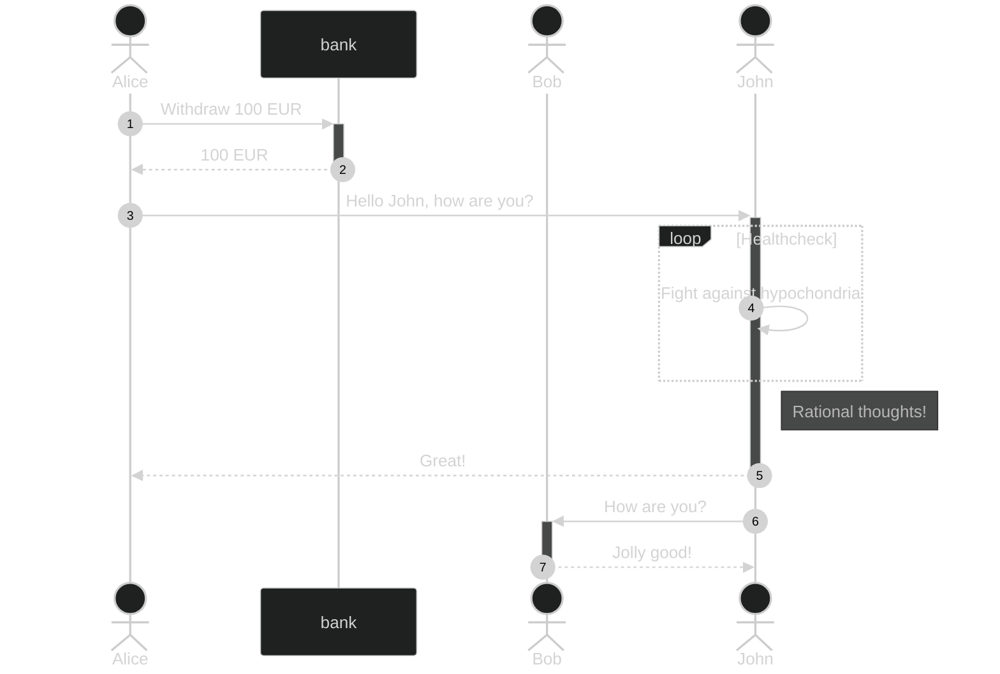

```mermaid
---
config:
  theme: dark
  look: classic
---

sequenceDiagram
autonumber
    actor Alice

    participant Bank as bank
    actor Bob
    actor John

    Alice ->> +Bank: Withdraw 100 EUR
    Bank -->> -Alice: 100 EUR


    Alice ->> +John: Hello John, how are you?
    loop Healthcheck
        John ->> John: Fight against hypochondria
    end
    
    note right of John: Rational thoughts!

    John -->> -Alice: Great!
    John ->> +Bob: How are you?
    Bob -->> -John: Jolly good!
```

See also:
* [Sequence diagrams syntax](https://mermaid.ai/open-source/syntax/sequenceDiagram.html)

