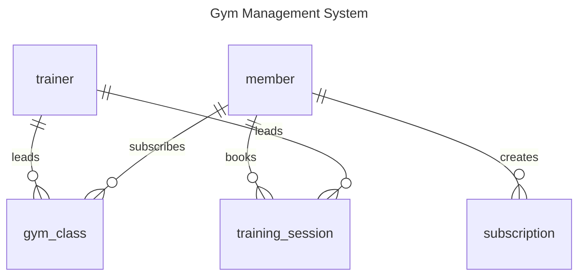
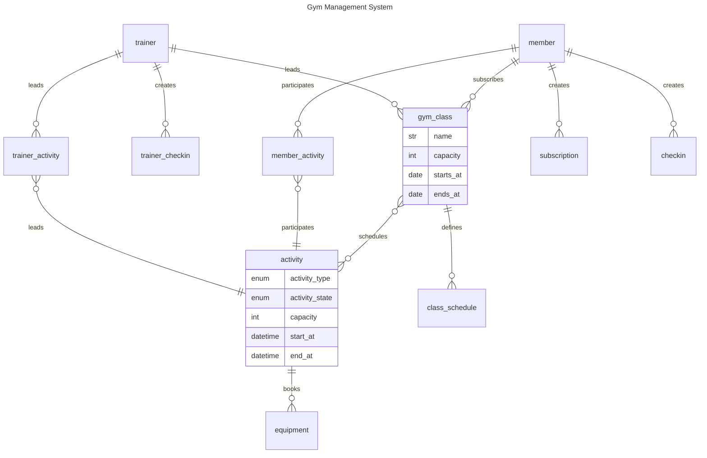

# Gym Domain Model

## Minimal Solution

```mermaid
---
title: Gym Management System
---
erDiagram
    trainer
    member

    member ||--o{ subscription : creates
    trainer ||--o{ gym_class : leads
    member ||--o{ gym_class : subscribes
    member ||--o{ training_session : books
    trainer ||--o{ training_session : leads
```

## Extended Model

```mermaid
---
title: Gym Management System
# config:
  # theme: default
  # look: handDrawn
  # fontFamily: Courier
---
erDiagram
    activity {
        enum activity_type
        enum activity_state
        int capacity
        datetime start_at
        datetime end_at
    }

    gym_class {
        str name
        int capacity
        date starts_at
        date ends_at
    }

    class_schedule {

    }

    trainer ||--o{ trainer_checkin : creates
    trainer ||--o{ trainer_activity : leads
    trainer_activity }o--|| activity : leads
    trainer ||--o{ gym_class : leads
    member ||--o{ gym_class : subscribes

    member ||--o{ member_activity : participates
    member_activity }o--|| activity : participates
    gym_class }o--o{ activity : schedules
    gym_class ||--o{ class_schedule : defines
    member ||--o{ subscription : creates
    activity ||--o{ equipment : books
    member ||--o{ checkin : creates
```

activity_type:
* class
* individual

activity_state:
* scheduled
* in progress
* completed
* cancelled
