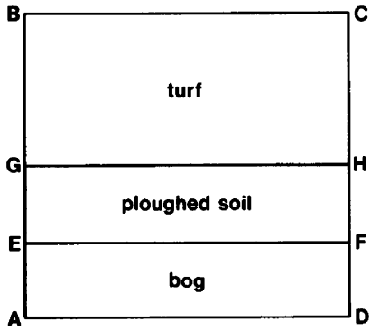

## P25 - Fieldcraft

The diagram represents a square field with 600 ft sides.

(1) In the field are three types of surface: turf, ploughed soil, and
bog.

(2) The rectangular section AEFD is bog - AE is 100 ft wide.

(3) The section EGHF is ploughed soil- EG is 200 ft wide.

(4) The remaining section, GBCH, is turf- BG is, of course, 300 ft.

(5) A farmer starts at point A to get to C. He can travel at 2.5 ft/sec in bog, 5 ft/sec on ploughed soil, and 10 Wsec on tUrf.

What is the shortest time (to the nearest second) in which the farmer can get to C?
